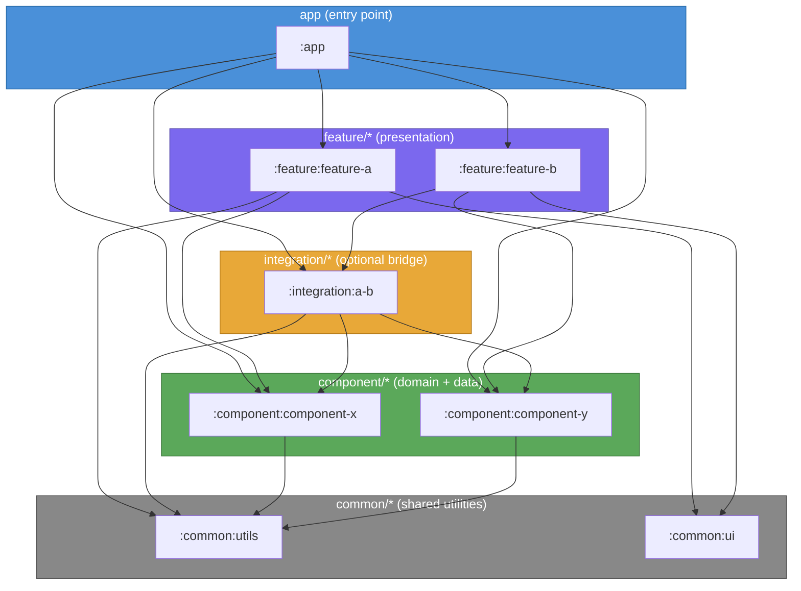
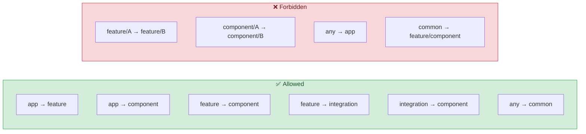

# Android Modularization

## Overview

This skill defines a **four-layer module architecture** for Android projects that scales well, enforces separation of concerns, and avoids circular dependencies. It is entirely project-agnostic and can be applied to any Android codebase.

---

## Module Layers

```
app/
feature/
  └── feature-a/
  └── feature-b/
component/
  └── component-x/
  └── component-y/
integration/          ← optional, bridges components
  └── integration-ab/
common/
  └── common-utils/
  └── common-ui/
```

### Layer Diagram



> **Read the arrows as "depends on"**. Arrows always flow downward — never upward, never sideways within the same layer.

### Layer Responsibilities

| Layer | Scope | Contains |
|---|---|---|
| **`app`** | Entry point & wiring | DI initialization, Navigation graphs, Application class |
| **`feature/*`** | UI presentation | Screens, ViewModels, MVI Contracts |
| **`component/*`** | Business logic | Domain Models, Use Cases, Repository interfaces + implementations, Data Sources |
| **`integration/*`** | Cross-component orchestration | Use Cases that coordinate ≥2 components |
| **`common/*`** | Shared utilities | Extensions, formatters, shared UI primitives, no business logic |

---

## Dependency Rules (Critical)

```
app         → feature/*, component/*, integration/*, common/*
feature/*   → component/*, integration/*, common/*
integration/* → component/*, common/*
component/* → common/* only
common/*    → (no dependencies)
```

### Allowed vs Forbidden Dependencies



### Zero-Tolerance Rules

- ❌ `feature/A` → `feature/B` — Features must never depend on each other
- ❌ `component/A` → `component/B` — Components must never depend on each other
- ❌ Any module → `app` — `app` is a leaf consumer
- ✅ When `component/A` needs `component/B`, create `integration/A-B`

### Why These Rules?

- **Prevents circular dependencies**: A → B → A impossible
- **Enables independent testing**: Each module testable in isolation
- **Parallel development**: Teams can work on separate features simultaneously
- **Easy replacement**: Swap implementations without breaking consumers

---

## Module Structure by Type

### Feature Module

```
feature/my-feature/
├── build.gradle.kts
└── src/
    └── main/java/.../feature/myfeature/
        ├── MyFeatureContract.kt       # ViewState / ViewEvent / SideEffect
        ├── MyFeatureViewModel.kt
        ├── MyFeatureScreen.kt
        └── components/               # Internal composables
```

**`build.gradle.kts`** (minimal):
```kotlin
plugins {
    id("android-library-convention")   // your convention plugin
    id("compose-convention")
    id("unit-test-convention")
}

dependencies {
    implementation(project(":component:my-component"))
    implementation(project(":common:ui"))
}
```

### Component Module

```
component/my-component/
├── build.gradle.kts
└── src/
    └── main/java/.../component/mycomponent/
        ├── domain/
        │   ├── model/          # Domain data classes
        │   ├── repository/     # Repository interfaces
        │   └── usecase/        # Use Cases
        └── data/
            ├── repository/     # Repository implementations
            ├── datasource/     # Local / Remote data sources
            └── mapper/         # Entity ↔ Domain mappers
```

**`build.gradle.kts`** (minimal):
```kotlin
plugins {
    id("android-library-convention")
    id("unit-test-convention")
}

dependencies {
    implementation(project(":common:utils"))
}
```

### Common Module

```
common/utils/
├── build.gradle.kts
└── src/
    └── main/java/.../common/utils/
        ├── extensions/
        └── formatters/
```

Common modules have **zero dependencies** on other project modules.

---

## DI Wiring — Always in `app`

All Dependency Injection configuration is centralized in the `app` module.

```
app/src/main/java/.../di/
├── AppModule.kt           # Platform & framework providers
├── RepositoryModule.kt    # Data layer bindings
├── DomainModule.kt        # Use Cases
└── ViewModelModule.kt     # ViewModels
```

- Feature and component modules use **constructor injection only**
- They never contain DI setup code

---

## Navigation — Always in `app`

All navigation graphs live in `app/navigation/`.

```
app/src/main/java/.../navigation/
├── RootNavGraph.kt
└── myfeature/
    └── MyFeatureNavigation.kt
```

- Feature modules expose **screen composables only**
- Navigation side effects are handled at the `app` level

---

## When to Create an Integration Module

Create `integration/A-B` when:

1. A Use Case from `component/A` needs data from `component/B`
2. An orchestration flow spans multiple components
3. You find yourself wanting to add `component/B` as a dependency of `component/A`

```kotlin
// integration/order-payment/domain/usecase/PlaceOrderUseCase.kt
class PlaceOrderUseCase(
    private val orderRepository: OrderRepository,      // from component/order
    private val paymentRepository: PaymentRepository,  // from component/payment
)
```

---

## Common Anti-Patterns

### ❌ Business logic in feature modules

```kotlin
// BAD — logic inside ViewModel
class OrderViewModel : ViewModel() {
    fun calculateTotal(items: List<Item>): Double {
        return items.sumOf { it.price * it.quantity } * 1.21  // VAT hardcoded
    }
}
```

```kotlin
// GOOD — logic in Use Case inside component
class CalculateOrderTotalUseCase(private val taxRate: Double) {
    operator fun invoke(items: List<Item>): Double =
        items.sumOf { it.price * it.quantity } * (1 + taxRate)
}
```

### ❌ Shared state between features via direct dependency

```kotlin
// BAD
// feature/checkout depends on feature/cart
implementation(project(":feature:cart"))
```

```kotlin
// GOOD — both features depend on component/cart
// feature/checkout → component/cart
// feature/cart     → component/cart
```

### ❌ Repository implementation in domain layer

```kotlin
// BAD — RepositoryImpl inside domain/
component/orders/domain/repository/OrderRepositoryImpl.kt
```

```kotlin
// GOOD — interface in domain, impl in data
component/orders/domain/repository/OrderRepository.kt      // interface
component/orders/data/repository/OrderRepositoryImpl.kt    // implementation
```

---

## Checklist: New Module

- [ ] Module placed in correct layer (`feature/`, `component/`, `common/`, `integration/`)
- [ ] Only depends on layers below it (see dependency table)
- [ ] No dependency on `app` module
- [ ] Business logic NOT placed in `feature` module
- [ ] UI NOT placed in `component` module
- [ ] DI registration added in `app/di/`
- [ ] Navigation (if UI module) added in `app/navigation/`
- [ ] Convention plugin applied (no manual SDK/test config)

---

## References

- [Android Guide to App Architecture](https://developer.android.com/topic/architecture)
- [Android Modularization Guide](https://developer.android.com/topic/modularization)
- [Now in Android — modularization example](https://github.com/android/nowinandroid)
