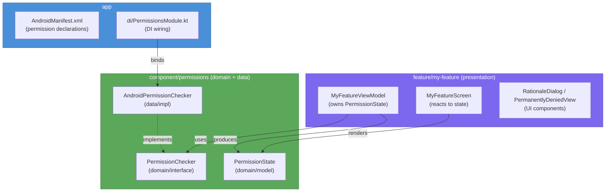

# Android Permissions (Multi-Module Architecture)

## Overview

Runtime permissions span all four architectural layers. This guide defines **exactly where each piece lives**, how layers communicate, and what each layer is responsible for — following the same rules as [android-modularization](../android-modularization/SKILL.md).

```
app/                     ← Manifest declarations + DI wiring
feature/my-feature/      ← Screen, ViewModel, permission UI (rationale, denied)
component/permissions/   ← Domain model + PermissionChecker abstraction + Android impl
common/                  ← (no permissions logic — leaf layer)
```

---

## Layer Diagram



> **Read the arrows as "depends on"**. `feature` → `component`. `app` binds the implementation. `feature` never touches `AndroidPermissionChecker` directly.

---

## Layer Responsibilities

| Layer | Responsibility | Contains |
|---|---|---|
| **`app`** | Declares permissions in Manifest + wires DI | `AndroidManifest.xml`, `PermissionsModule.kt` |
| **`feature/*`** | Owns `PermissionState` in ViewModel, renders UI | Contract, ViewModel, Screen, Rationale/Denied views |
| **`component/permissions`** | Defines the abstraction + Android implementation | `PermissionState`, `PermissionChecker`, `AndroidPermissionChecker` |
| **`common/*`** | Nothing permissions-related | (leaf layer, no Android dependencies) |

---

## `component/permissions` — Module Structure

```
component/permissions/
├── build.gradle.kts
└── src/
    └── main/java/.../permissions/
        ├── domain/
        │   ├── model/
        │   │   └── PermissionState.kt      ← sealed interface
        │   └── PermissionChecker.kt        ← interface (contract)
        └── data/
            └── AndroidPermissionChecker.kt ← Android implementation
```

**`build.gradle.kts`** (minimal):
```kotlin
plugins {
    id("android-library-convention")
    id("unit-test-convention")
}
// No dependency on feature/* or app — component is a leaf
```

### Domain Model

```kotlin
// component/permissions/domain/model/PermissionState.kt

sealed interface PermissionState {
    /** Never requested — proceed directly to system dialog. */
    data object Unknown : PermissionState

    /** Granted — feature can proceed. */
    data object Granted : PermissionState

    /**
     * Denied but re-requestable.
     * Show a rationale explaining WHY the app needs it before asking again.
     */
    data object ShowRationale : PermissionState

    /**
     * User chose "Don't ask again" — only the system Settings can unblock.
     * Guide the user to open App Settings.
     */
    data object PermanentlyDenied : PermissionState
}
```

### Domain Interface

```kotlin
// component/permissions/domain/PermissionChecker.kt

interface PermissionChecker {
    /** Returns the current state for a single permission string. */
    fun checkState(permission: String): PermissionState

    /** Must be called once before launching the system dialog. */
    fun markRequested(permission: String)

    /** True if this permission was ever requested before. */
    fun wasRequested(permission: String): Boolean
}
```

### Data Implementation

```kotlin
// component/permissions/data/AndroidPermissionChecker.kt

class AndroidPermissionChecker(
    private val activity: ComponentActivity,
    private val prefs: SharedPreferences,         // injected by app/di
) : PermissionChecker {

    override fun checkState(permission: String): PermissionState {
        val granted = ContextCompat.checkSelfPermission(activity, permission) ==
                PackageManager.PERMISSION_GRANTED
        if (granted) return PermissionState.Granted

        val showRationale = activity.shouldShowRequestPermissionRationale(permission)
        if (showRationale) return PermissionState.ShowRationale

        // shouldShowRationale == false has two meanings:
        //   1. Never asked  → Unknown
        //   2. Permanently denied
        return if (!wasRequested(permission)) PermissionState.Unknown
        else PermissionState.PermanentlyDenied
    }

    override fun markRequested(permission: String) {
        prefs.edit().putBoolean(key(permission), true).apply()
    }

    override fun wasRequested(permission: String): Boolean =
        prefs.getBoolean(key(permission), false)

    private fun key(permission: String) = "perm_requested_$permission"
}
```

---

## `feature/my-feature` — Module Structure

```
feature/my-feature/
├── build.gradle.kts
└── src/
    └── main/java/.../feature/myfeature/
        ├── MyFeatureContract.kt           ← ViewState / Event / Effect
        ├── MyFeatureViewModel.kt
        ├── MyFeatureScreen.kt
        └── components/
            ├── RationaleDialog.kt
            └── PermanentlyDeniedView.kt
```

**`build.gradle.kts`** (minimal):
```kotlin
plugins {
    id("android-library-convention")
    id("compose-convention")
    id("unit-test-convention")
}

dependencies {
    implementation(project(":component:permissions"))  // domain model + interface only
}
```

### Contract

```kotlin
// MyFeatureContract.kt

data class MyFeatureViewState(
    val permissionState: PermissionState = PermissionState.Unknown,
    val isFeatureReady: Boolean = false,
)

sealed interface MyFeatureEvent {
    data object OnScreenEntered : MyFeatureEvent
    data object OnPermissionGranted : MyFeatureEvent
    data object OnPermissionDenied : MyFeatureEvent
    data object OnRationaleConfirmed : MyFeatureEvent
    data object OnOpenSettingsClicked : MyFeatureEvent
}

sealed interface MyFeatureEffect {
    data class LaunchPermissionRequest(val permission: String) : MyFeatureEffect
    data object OpenAppSettings : MyFeatureEffect
}
```

### ViewModel

The ViewModel depends on the **interface** (`PermissionChecker`) — never on `AndroidPermissionChecker`.

```kotlin
// MyFeatureViewModel.kt

class MyFeatureViewModel(
    private val permissionChecker: PermissionChecker,       // interface from component/
) : ViewModel() {

    private val _state = MutableStateFlow(MyFeatureViewState())
    val state: StateFlow<MyFeatureViewState> = _state.asStateFlow()

    private val _effects = Channel<MyFeatureEffect>(Channel.BUFFERED)
    val effects: Flow<MyFeatureEffect> = _effects.receiveAsFlow()

    fun onEvent(event: MyFeatureEvent) = when (event) {
        MyFeatureEvent.OnScreenEntered         -> checkPermission()
        MyFeatureEvent.OnPermissionGranted     -> onGranted()
        MyFeatureEvent.OnPermissionDenied      -> onDenied()
        MyFeatureEvent.OnRationaleConfirmed    -> launchRequest()
        MyFeatureEvent.OnOpenSettingsClicked   -> openSettings()
    }

    private fun checkPermission() {
        val perm = Manifest.permission.CAMERA
        _state.update { it.copy(permissionState = permissionChecker.checkState(perm)) }
        if (_state.value.permissionState == PermissionState.Unknown) launchRequest()
    }

    private fun launchRequest() {
        permissionChecker.markRequested(Manifest.permission.CAMERA)
        viewModelScope.launch {
            _effects.send(MyFeatureEffect.LaunchPermissionRequest(Manifest.permission.CAMERA))
        }
    }

    private fun onGranted() {
        _state.update { it.copy(permissionState = PermissionState.Granted, isFeatureReady = true) }
    }

    private fun onDenied() {
        _state.update { it.copy(permissionState = PermissionState.ShowRationale) }
    }

    private fun openSettings() {
        viewModelScope.launch { _effects.send(MyFeatureEffect.OpenAppSettings) }
    }
}
```

### Screen

The Screen is stateless — it only reacts to `ViewState` and dispatches `Event`s.

```kotlin
// MyFeatureScreen.kt

@Composable
fun MyFeatureScreen(
    state: MyFeatureViewState,
    onEvent: (MyFeatureEvent) -> Unit,
    effects: Flow<MyFeatureEffect>,
) {
    val launcher = rememberLauncherForActivityResult(
        ActivityResultContracts.RequestPermission()
    ) { granted ->
        if (granted) onEvent(MyFeatureEvent.OnPermissionGranted)
        else onEvent(MyFeatureEvent.OnPermissionDenied)
    }

    val context = LocalContext.current

    LaunchedEffect(Unit) { onEvent(MyFeatureEvent.OnScreenEntered) }

    LaunchedEffect(Unit) {
        effects.collect { effect ->
            when (effect) {
                is MyFeatureEffect.LaunchPermissionRequest ->
                    launcher.launch(effect.permission)

                MyFeatureEffect.OpenAppSettings ->
                    context.startActivity(
                        Intent(Settings.ACTION_APPLICATION_DETAILS_SETTINGS).apply {
                            data = Uri.fromParts("package", context.packageName, null)
                        }
                    )
            }
        }
    }

    when (state.permissionState) {
        PermissionState.Unknown,
        PermissionState.Granted      -> FeatureContent(ready = state.isFeatureReady)

        PermissionState.ShowRationale -> RationaleDialog(
            title   = "Camera required",
            message = "This feature needs camera access to work.",
            onConfirm = { onEvent(MyFeatureEvent.OnRationaleConfirmed) },
            onDismiss = {},
        )

        PermissionState.PermanentlyDenied -> PermanentlyDeniedView(
            onOpenSettings = { onEvent(MyFeatureEvent.OnOpenSettingsClicked) }
        )
    }
}
```

### UI Components

```kotlin
// components/RationaleDialog.kt

@Composable
fun RationaleDialog(
    title: String,
    message: String,
    onConfirm: () -> Unit,
    onDismiss: () -> Unit,
) {
    AlertDialog(
        onDismissRequest = onDismiss,
        title   = { Text(title) },
        text    = { Text(message) },
        confirmButton = { TextButton(onClick = onConfirm) { Text("Allow") } },
        dismissButton = { TextButton(onClick = onDismiss) { Text("Not now") } },
    )
}

// components/PermanentlyDeniedView.kt

@Composable
fun PermanentlyDeniedView(
    permissionName: String = "This",
    onOpenSettings: () -> Unit,
) {
    Column(
        modifier = Modifier.fillMaxWidth().padding(24.dp),
        horizontalAlignment = Alignment.CenterHorizontally,
        verticalArrangement = Arrangement.spacedBy(16.dp),
    ) {
        Icon(Icons.Default.Block, contentDescription = null)
        Text(
            text = "$permissionName permission is required.",
            textAlign = TextAlign.Center,
        )
        Text(
            text = "You've denied this permission permanently. Enable it in App Settings.",
            textAlign = TextAlign.Center,
        )
        Button(onClick = onOpenSettings) { Text("Open Settings") }
    }
}
```

---

## DI Wiring — Always in `app`

```
app/src/main/java/.../di/
└── PermissionsModule.kt
```

```kotlin
// app/di/PermissionsModule.kt

val permissionsModule = module {
    // AndroidPermissionChecker is the only place the Android impl is referenced
    factory<PermissionChecker> {
        AndroidPermissionChecker(
            activity = get(),       // activity scoped — provide via KoinAndroidScope or factory
            prefs    = androidContext().getSharedPreferences("permissions", Context.MODE_PRIVATE),
        )
    }
}
```

- `feature` modules depend on the **interface** (`PermissionChecker`) — zero knowledge of the impl.
- Swapping to a mock or stub for tests requires only changing this one binding.

---

## `app/AndroidManifest.xml` — Declare All Permissions

```xml
<!-- Standard -->
<uses-permission android:name="android.permission.CAMERA" />
<uses-permission android:name="android.permission.RECORD_AUDIO" />
<uses-permission android:name="android.permission.POST_NOTIFICATIONS" />  <!-- API 33+ -->

<!-- Bluetooth — split by API level -->
<uses-permission
    android:name="android.permission.BLUETOOTH_SCAN"
    android:usesPermissionFlags="neverForLocation" />         <!-- API 31+ -->
<uses-permission android:name="android.permission.BLUETOOTH_CONNECT" />  <!-- API 31+ -->
<uses-permission android:name="android.permission.BLUETOOTH"
    android:maxSdkVersion="30" />                             <!-- legacy -->

<!-- Location -->
<uses-permission android:name="android.permission.ACCESS_FINE_LOCATION" />
<uses-permission android:name="android.permission.ACCESS_BACKGROUND_LOCATION" />  <!-- API 29+ -->
```

> Only `app` has the Manifest. No `feature` or `component` module should contain Manifest permission declarations.

---

## Special Cases by Permission Group

### `POST_NOTIFICATIONS` (API 33+)

```kotlin
// In ViewModel — guard the launch
private fun launchNotificationRequest() {
    if (Build.VERSION.SDK_INT >= Build.VERSION_CODES.TIRAMISU) {
        launchRequest(Manifest.permission.POST_NOTIFICATIONS)
    }
    // Below API 33 → already granted by default
}
```

### Bluetooth (API split)

```kotlin
// In ViewModel
private fun bluetoothPermissions(): Array<String> =
    if (Build.VERSION.SDK_INT >= Build.VERSION_CODES.S) {
        arrayOf(
            Manifest.permission.BLUETOOTH_SCAN,
            Manifest.permission.BLUETOOTH_CONNECT,
        )
    } else {
        arrayOf(
            Manifest.permission.BLUETOOTH,
            Manifest.permission.ACCESS_FINE_LOCATION,
        )
    }
```

### Background Location (two-step)

```kotlin
// Step 1: request foreground first → onEvent(PermissionGranted)
// Step 2: only then request background
// Never request both simultaneously — system will reject background silently.
```

---

## Testing

The ViewModel depends on `PermissionChecker` (interface) — easy to mock:

```kotlin
class MyFeatureViewModelTest {

    @get:Rule
    val mainDispatcherRule = MainDispatcherRule()

    private val checker: PermissionChecker = mockk()
    private lateinit var sut: MyFeatureViewModel

    @Before
    fun setup() {
        sut = MyFeatureViewModel(checker)
    }

    @Test
    fun `GIVEN unknown state WHEN screen entered THEN launches request`() = runTest {
        every { checker.checkState(any()) } returns PermissionState.Unknown
        every { checker.markRequested(any()) } just Runs

        val effects = mutableListOf<MyFeatureEffect>()
        val job = launch { sut.effects.toList(effects) }

        sut.onEvent(MyFeatureEvent.OnScreenEntered)
        advanceUntilIdle()
        job.cancel()

        assertTrue(effects.any { it is MyFeatureEffect.LaunchPermissionRequest })
    }

    @Test
    fun `GIVEN denied WHEN onPermissionDenied THEN state is ShowRationale`() = runTest {
        sut.onEvent(MyFeatureEvent.OnPermissionDenied)
        advanceUntilIdle()
        assertEquals(PermissionState.ShowRationale, sut.state.value.permissionState)
    }

    @Test
    fun `GIVEN granted WHEN onPermissionGranted THEN feature is ready`() = runTest {
        sut.onEvent(MyFeatureEvent.OnPermissionGranted)
        advanceUntilIdle()
        assertTrue(sut.state.value.isFeatureReady)
        assertEquals(PermissionState.Granted, sut.state.value.permissionState)
    }
}
```

---

## Common Anti-Patterns

### ❌ Android imports inside `component` domain layer

```kotlin
// BAD — domain model with Android import
import android.content.pm.PackageManager

data class PermissionState(val androidCode: Int)  // tied to Android SDK
```

```kotlin
// GOOD — pure Kotlin sealed interface
sealed interface PermissionState { ... }  // zero imports
```

### ❌ `AndroidPermissionChecker` used directly in a feature

```kotlin
// BAD — feature knows the concrete implementation
class MyViewModel(
    private val checker: AndroidPermissionChecker,  // ❌ references data layer impl
)
```

```kotlin
// GOOD — feature depends on interface only
class MyViewModel(
    private val checker: PermissionChecker,  // ✅ interface from component/permissions/domain
)
```

### ❌ Permission logic in the Screen composable

```kotlin
// BAD — Screen decides permission flow
@Composable
fun MyScreen() {
    val granted = ContextCompat.checkSelfPermission(...)
    if (!granted) { requestPermission() }
}
```

```kotlin
// GOOD — Screen only reacts to ViewState
@Composable
fun MyScreen(state: MyFeatureViewState, onEvent: (MyFeatureEvent) -> Unit) {
    when (state.permissionState) {
        PermissionState.ShowRationale -> RationaleDialog(...)
        ...
    }
}
```

### ❌ Assuming first denial = permanently denied

```kotlin
// BAD — no tracking of first request
if (!shouldShowRationale && !granted) → PermanentlyDenied  // wrong on first ask
```

```kotlin
// GOOD — track via wasRequested()
if (!shouldShowRationale && !granted && wasRequested(perm)) → PermanentlyDenied
```

---

## Checklist: Adding Permissions to a Feature

- [ ] Permission declared in `app/AndroidManifest.xml`
- [ ] `PermissionState` model lives in `component/permissions/domain/`
- [ ] `PermissionChecker` interface defined in `component/permissions/domain/`
- [ ] `AndroidPermissionChecker` lives in `component/permissions/data/`
- [ ] DI binding added in `app/di/PermissionsModule.kt`
- [ ] Feature ViewModel depends on `PermissionChecker` interface only
- [ ] `PermissionState` owned in `ViewState` — Screen does not compute it
- [ ] `wasRequested()` tracking implemented (distinguish Unknown from PermanentlyDenied)
- [ ] API-level guards added for `POST_NOTIFICATIONS` (≥ 33) and Bluetooth (≥ 31)
- [ ] Background location requested **after** foreground is granted
- [ ] ViewModel unit tests use mocked `PermissionChecker`

---

## References

- [Android Permissions Overview](https://developer.android.com/guide/topics/permissions/overview)
- [Request runtime permissions](https://developer.android.com/training/permissions/requesting)
- [ActivityResultContracts](https://developer.android.com/reference/androidx/activity/result/contract/ActivityResultContracts)
- [Permissions best practices](https://developer.android.com/training/permissions/usage-notes)
- [Android Modularization Guide](https://developer.android.com/topic/modularization)
